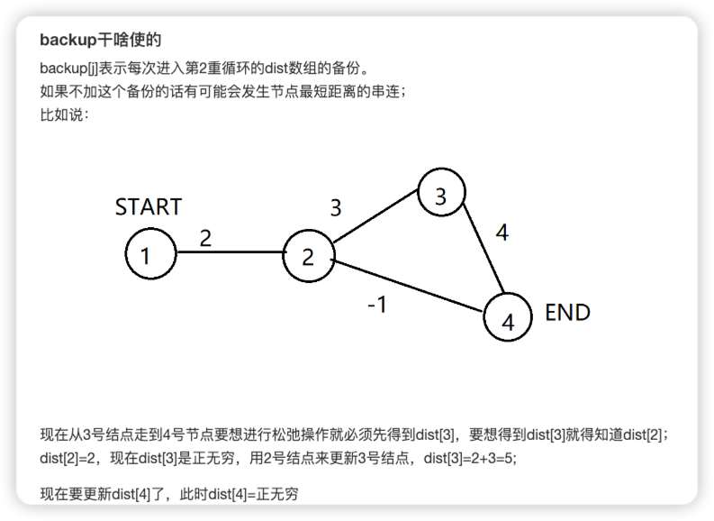
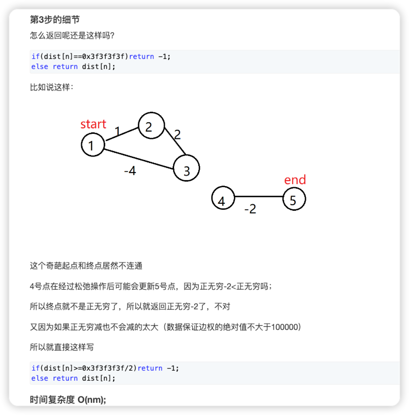

- dijkstra算法在负权回路中不能使用原因

- 什么是bellman - ford算法？
  - Bellman - ford 算法是求含负权图的单源最短路径的一种算法，效率较低，代码难度较小。其原理为连续进行松弛，在每次松弛时把每条边都更新一下，若在 n-1 次松弛后还能更新，则说明图中有负环，因此无法得出结果，否则就完成。
  - (通俗的来讲就是：假设 1 号点到 n 号点是可达的，每一个点同时向指向的方向出发，更新相邻的点的最短距离，通过循环 n-1 次操作，若图中不存在负环，则 1 号点一定会到达 n 号点，若图中存在负环，则在 n-1 次松弛后一定还会更新)

