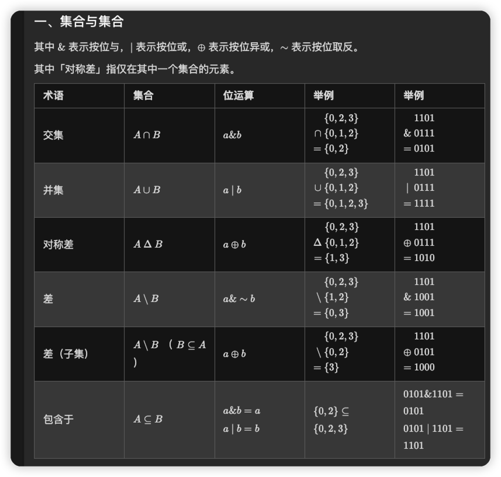

> 位运算(集合set)

## 位运算
```bash
   1. &:按位与运算符,参与运算的两个值,如果两个相应位都为1,则该位的结果为1,否则为0
   2. |:按位或运算符,只要对应的二个二进位有一个为1时,结果位就为1
   3. ^:按位异或运算符,当两对应的二进位相异时,结果为1
   4. ~:按位取反运算符,对数据的每个二进制位取反,即把1变为0,把0变为1
   5. >>:右移动运算符,把 >> 左边的运算数的各二进位全部右移若干位,>> 右边的数指定移动的位数
   6. <<:左移动运算符,运算数的各二进位全部左移若干位,由 << 右边的数指定移动的位数,高位丢弃,低位补0
   
    a = 0001 0101
    b = 0000 0110
     
    a&b = 0000 0100 # 
    a|b = 0001 0111 # 有1为1 无1为0
    a^b = 0001 0011 # 相同为0 相异为1
    ~a = 1110 1010 #取反
    a<<2 = 01010100 #左移动两位
    a>>2 = 0000 0101 #右移动两位
```

## https://leetcode.cn/circle/discuss/CaOJ45/ 位运算总结 灵神

# 集合与集合

```python3
if __name__ == '__main__':
    arr1 = [1, 2, 3, 4, 5]
    arr2 = [3, 4, 5, 6, 7]
    # 交集
    print(set(arr1) & set(arr2))
    # 并集
    print(set(arr1) | set(arr2))
    # 差
    print(set(arr1) - set(arr2))
    # 差
    print(set(arr2) - set(arr1))
```

# 集合与元素
# 遍历集合
# 枚举集合


## 进制转换
```python3
if __name__ == '__main__':
    # 十进制转二进制函数： bin() 函数返回的字符串前缀为 "0b"，表示这是一个二进制数字。
    print(bin(400))
    # 十进制转八进制： oct() 函数返回的字符串前缀为 "0o"，表示这是一个八进制数字。
    print(oct(400))
    # 十进制转十六进制： hex() 函数返回的字符串前缀为 "0x"，表示这是一个十六进制数字。
    print(hex(400))
    # x进制转十进制 int(a,x)
    print(int("1111", 2))

    
```
