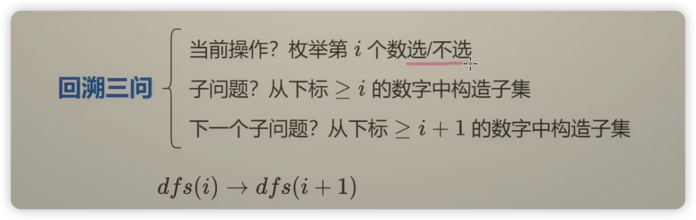

# 组合和排列的区别

- 在排列中元素的顺序是有区别的 1,2 /2,1 但是在组合中是同一种类型

# 回溯

> 回溯答案添加写法1

```python3
ans=[]
path = []  # 空数组

ans.append(path.copy())
path.append(1)
path.pop()
```

> 回溯答案添加写法2

```python3
n = 10
ans=[]
path = [0] * n  # 空数组
ans.append(path.copy())
path[i] = 1
```

## 子集型




- [灵茶山艾府_回溯 子集型 分割回文串](https://www.bilibili.com/video/BV1mG4y1A7Gu/?spm_id_from=333.788&vd_source=5c4d3e12d3512ed84532d27dcef8ab0d)

## 组合型

- [灵茶山艾府_回溯 组合型 剪枝 77 216 22](https://www.bilibili.com/video/BV1xG4y1F7nC/?spm_id_from=333.788&vd_source=5c4d3e12d3512ed84532d27dcef8ab0d)


## 排列型

- [灵茶山艾府_回溯 排列型 N皇后 46 51](https://www.bilibili.com/video/BV1mY411D7f6/?spm_id_from=333.788&vd_source=5c4d3e12d3512ed84532d27dcef8ab0d)