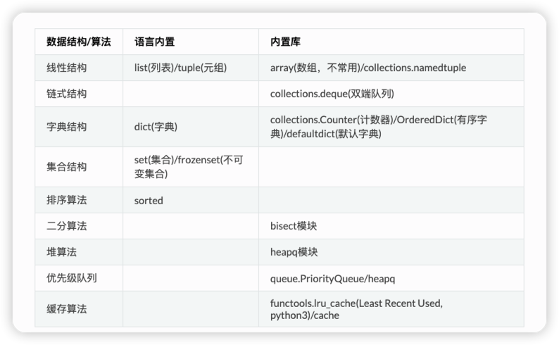

## Python3 刷算法

- 常用内置数据类型：list, tuple, dict, set, frozenset
- collections 模块：Counter(计数器), deque(双端队列), OrderedDict(有序字典)，defaultdict(默认值字典)
- heapq: 堆操作
- bisect: 二分查找
- 矩阵。正确初始化一个不可变对象的二维数组：dp = [ [0]*col for _ in range(row) ]
- 缓存。python3 的 functools 模块自带了 cache(等价于lru_cache(maxsize=None)) 和 lru_cache 装饰器，在一些需要递归记忆化搜索的时候会很方便
  

### python 递归暴栈(栈溢出)

python 递归函数默认递归深度比较小，你可以通过 sys.getrecursionlimit() 函数打印出来。 我在 mac 机器上测试的时候，以下结果 python2 输出
1000。这就导致一些递归函数测试用例稍微多一些就会报错。 (一个用例超过上千个数据就会报错了)

```python
import sys

print(sys.getrecursionlimit())  # 我的 mac 机器上输出 1000
```

可以把以下代码设置最大栈深度，放到文件开头，在牛客上提交代码的时候可以避免一些递归代码报错。 (leetcode 似乎给设置了，类似的题目发现力扣上提交不会栈溢出但是在牛客就会)

```python
import sys

sys.setrecursionlimit(100000)  # 设置函数栈深度足够大，避免栈溢出错误
```

### python list 技巧

```python
# 排序嵌套 list
l = [('a', 1), ('c', 2), ('b', 3)]
sorted(l, key=lambda p: p[0])  # 根据第1个值排序，[('a', 1), ('b', 3), ('c', 2)]
sorted(l, key=lambda p: p[1])  # 根据第2个值排序，[('a', 1), ('c', 2), ('b', 3)]
sorted(l, key=lambda p: (p[0], p[1]))  # 根据元组第0个值升序排序，若第0个值相等则根据第1个值升序排序
sorted(l, key=lambda p: (p[0], -p[1]))  # 根据元组第0个值升序排序，若第0个值相等则根据第1个值降序排序

# 同时获取最大值的下标和值
l = [1, 2, 5, 4, 3]
maxi, maxval = max(enumerate(l), key=lambda iv: iv[1])  # 2, 5

# python3 排序list自定义函数(python2 直接用 cmp 参数， python3 需要用 cmp_to_key 转成 key 参数)
from functools import cmp_to_key

nums = [3, 2, 1, 4, 5]
sorted(nums, key=cmp_to_key(lambda a, b: a - b))  # [1 ,2 ,3, 4, 5]
sorted(nums, key=cmp_to_key(lambda a, b: b - a))  # [5, 4, 3, 2, 1]

# 一行代码判断列表是否有序
issorted = all(l[i] <= l[i + 1] for i in range(len(l) - 1))

# python3 一行代码求前缀和
from itertools import accumulate

presums = list(accumulate([1, 2, 3]))  # [1, 3, 6]

matrix = [[]]
# 一行代码求矩阵元素总和 https://stackoverflow.com/questions/10713150/how-to-sum-a-2d-array-in-python
allsum = sum(map(sum, matrix))  # 或者 allsum = sum((sum(row) for row in matrix))
```

### python dict 技巧

```python
# python 根据 key，value 排序字典
d = {'d': 4, 'a': 1, 'b': 2, 'c': 3}
# dict sort by **key** and reverse
dict(sorted(d.items()))  # {'a': 1, 'b': 2, 'c': 3, 'd': 4}
dict(sorted(d.items(), reverse=True))  # {'d': 4, 'c': 3, 'b': 2, 'a': 1}

# dict sort by **value** and reverse
dict(sorted(d.items(), key=lambda kv: kv[1]))  # {'a': 1, 'b': 2, 'c': 3, 'd': 4}
dict(sorted(d.items(), key=lambda kv: kv[1], reverse=True))  # {'d': 4, 'c': 3, 'b': 2, 'a': 1}

# 获取字典对应的最大值对应的 key,value
mydict = {'A': 4, 'B': 10, 'C': 0, 'D': 87}
maximum = max(mydict, key=mydict.get)  # Just use 'min' instead of 'max' for minimum.
maxk, maxv = maximum, mydict[maximum]
# 或者
maxk, maxv = max(mydict.items(), key=lambda k: k[1])

# 支持默认值的有序字典 (OrderedDict and defaultdict)  (注意是 key 插入顺序不是字典序)
# https://stackoverflow.com/questions/6190331/how-to-implement-an-ordered-default-dict
od = OrderedDict()  # collections.OrderedDict()
i = 0
od[i] = od.get(i, 0) + 1  # 间接实现了 defaultdict(int) ，同时保持了插入字典的 key 顺序
```

```python
# 编写链表题目经常用到的一些通用函数和调试函数，定义等，方便代码调试

class ListNode(object):
    def __init__(self, val=0, next=None):
        self.val = val
        self.next = next

    def __str__(self):
        return 'Node({})'.format(self.val)

    # 用来输出调试
    __repr__ = __str__

# 缩写，单测方便写，比如构建链表 1->2->3  N(1, N(2, N(3)))
N = Node = ListNode

def to_list(head):
    """linked list to python []"""
    res = []
    curnode = head
    while curnode:
        res.append(curnode.val)
        curnode = curnode.next
    return res

def gen_list(nums):
    """用数组生成一个链表方便测试 [1,2,3] 1->2->3
    """
    if not nums:
        return None
    head = ListNode(nums[0])
    pre = head
    for i in range(1, len(nums)):
        node = ListNode(nums[i])
        pre.next = node
        pre = node
    return head

def print_list(head):
    """打印链表"""
    cur = head
    res = ""
    while cur:
        res += "{}->".format(cur.val)
        cur = cur.next
    res += "nil"
    print(res)
```