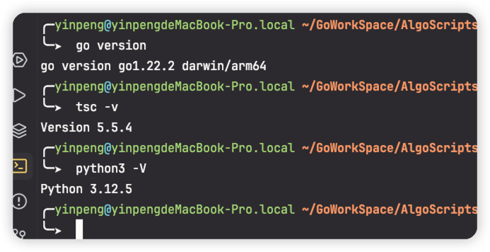
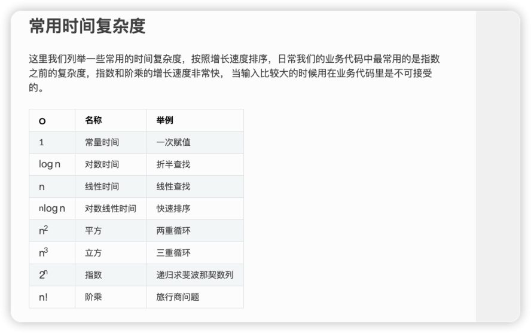

# AlgoScripts

<!-- PROJECT SHIELDS -->


<a href="https://github.com/hakusai22/AlgoScripts/">
    
</a>
&nbsp;
<a href="https://github.com/hakusai22/AlgoScripts/">
    
</a>
&nbsp;
<a href="https://github.com/hakusai22/AlgoScripts/">
    
</a>

<!-- PROJECT LOGO -->
<br />

### Documentation

- ⭐ [Python3 刷题总结](./Python3_README.md)
- ⭐ [Golang 刷题总结](./Go_README.md)

> 个人公司业务开发主要是Java后端(SpringBoot3.0+GRPC), Java相对于python3 写的代码看起来没有python那么优雅和使用的流畅 天天写Java 看着都烦😡,应用层的代码编写，
> 可替代性太强了，很像tcp四层模型，前端再应用层之上 应用层就是Java写业务代码  传输层的话 比如封装好的grpc开源项目 网络层和链路层 太底层了 接触不到 没什么理解，
> 可能大部分原因是因为每天干着重复的工作, 组内其他人写的Java代码看起来也提不上兴趣, 也对Java逐渐失去了耐心/兴趣 能写当前公司业务就行了, 至于深入挖掘 后面再规划吧。
> 现在业务天天需要刷数据 三种语言Java/python3/golang 来回切着写 怎么写着舒服怎么来 最近也是再看ts+react项目
> 好像搞开源啊，留给我的时间不多了⛽️


```shell
go version                                                                                                                                                              127 ↵
go version go1.22.2 darwin/arm64

tsc -v         
Version 5.5.4

python3 -V                
Python 3.12.5
```



####  Python
- Python的话 公司内部数据平台使用Django开发,当时2022校招进来 python连数据结构都写不明白 pip是什么 安装依赖也不会 都是当时带我的mentor导师手把手教我 现在回想起来当时是真的菜啊,
 后面就不断的去补python相关的知识点,在Acwing平台用Python3刷算法题 熟悉数据结构的使用,后面刷leetcode和打周赛都是使用python3, 真的是语法简洁 `人生苦短 python是岸`, 在日常工作中也是写各种脚本出来数据(sql/excel/redis/elastisearch等等)
 当然我们软件研发部门还会举办算法比赛 2022年第一次用Java写/当时python3不熟(三等奖) 2023年第二次组队Python3写(二等奖) 只能说我们研发部门挺开放的, 连测试OKR都是每周刷一道Leetcode题目。
 到现在的ai 自动帮你写脚本 自己从0->1写的比较少了 直接在生成的代码上稍微修改下就能用了。

#### Golang
- Golang 第一次接触还是2022年大四的时候参加线上的第二届字节青训营 做了一个douyin_demo的项目, 当时认识了一群人, 自己没有坚持下去, 加上周围朋友的影响 基本都是Golang 中间也是断断续续的学习 进步的速度特别慢 交流的圈子也没有
在2024年 上半年 才开始关注Cloudwego社区 去看kitex和hertz相关的项目 也去go-grpc/go-redis 相关项目 提交一些简单的pr 还是学习的时间安排的太少 没有深入去理解 现在开始全力以赴🌟🌟🌟
这个项目记录Golang(算法/性能/开源项目)的学习记录, 记录一些基础数据结构和语法特性的使用。
 
 
#### TypeScript
- 这两年我一直对前端很反感，工作上让我写前端我基本也是拒绝的，内部我们前端还是jquery/原生html/js/css, 所以我自己对前端一点兴趣也没有，
- 当时大三的时候学了一会vue，也写过demo和项目 现在基本已经忘记了。
- 最近逛github的时候 看到几个ai项目 前端的，代码拉下来 几乎颠覆了我这几年对前端的认知，一个项目全是ts+tsx, 没有我认知中的js/css/html，
- 原来才发现原地不动的只是我，公司的技术对个人心态/理解/认知影响太大了，没有跳出禁锢的圈子。
- 最近开始疯狂补前端知识点了，ts也是计划中的一部分。


> 根据题目的时间/空间复杂度 推算使用的算法


### 算法复杂度讲解


- https://zhuanlan.zhihu.com/p/248284657
- https://pegasuswang.github.io/python_data_structures_and_algorithms/06_%E7%AE%97%E6%B3%95%E5%88%86%E6%9E%90/big_o/
- logN 计算
```python
import math
print(math.log2(10 ** 5)) # 16.609640474436812
```

## Go 项目编译运行命令
```bash
go mod init	生成 go.mod 文件
go mod download	下载 go.mod 文件中指明的所有依赖
go mod tidy	整理现有的依赖
go mod graph	查看现有的依赖结构
go mod edit	编辑 go.mod 文件
go mod vendor	导出项目所有的依赖到vendor目录
go mod verify	校验一个模块是否被篡改过
go mod why	查看为什么需要依赖某模块
```

## Python3 项目编译运行命令
```bash
pip3 freeze > requirements.txt   

pip3  install -r requirements.txt
```

## TypeScript 


## star 趋势图


