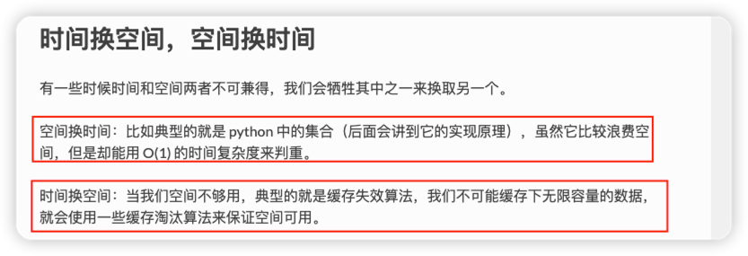

# Go_Python_Study

Go_Python_Study 学习记录

<!-- PROJECT SHIELDS -->

[![Contributors][contributors-shield]][contributors-url]
[![Forks][forks-shield]][forks-url]
[![Stargazers][stars-shield]][stars-url]
[![MIT License][license-shield]][license-url]


<!-- PROJECT LOGO -->
<br />


<p align="center">
    <a href="https://github.com/hakusai22/Go_Python_Study/">
    </a>
    <h3 align="center">Go_Python 算法学习笔记 🔞</h3>
  <p align="center">
    ·
    <a href="https://github.com/hakusai22/Go_Python_Study/issues">报告Bug</a>
    ·
    <a href="https://github.com/hakusai22/Go_Python_Study/issues">提出新特性</a>
  </p>


<!-- links -->

[your-project-path]:hakusai22/Go_Python_Study

[contributors-shield]: https://img.shields.io/github/contributors/hakusai22/Go_Python_Study.svg?style=for-the-badge

[contributors-url]: https://github.com/hakusai22/Go_Python_Study/graphs/contributors

[forks-shield]: https://img.shields.io/github/forks/hakusai22/Go_Python_Study.svg?style=for-the-badge

[forks-url]: https://github.com/hakusai22/Go_Python_Study/network/members

[stars-shield]: https://img.shields.io/github/stars/hakusai22/Go_Python_Study.svg?style=for-the-badge

[stars-url]: https://github.com/hakusai22/Go_Python_Study/stargazers

[issues-shield]: https://img.shields.io/github/issues/hakusai22/Go_Python_Study.svg?style=for-the-badge

[issues-url]: https://img.shields.io/github/issues/hakusai22/Go_Python_Study.svg

[license-shield]: https://img.shields.io/github/license/hakusai22/Go_Python_Study.svg?style=for-the-badge

[license-url]: https://github.com/hakusai22/Go_Python_Study/blob/master/LICENSE

[linkedin-shield]: https://img.shields.io/badge/-LinkedIn-black.svg?style=for-the-badge&logo=linkedin&colorB=555

[linkedin-url]: https://linkedin.com/in/xxxx


## [Python3 刷题总结](./Python3_README.md)
## [GO 刷题总结](./Go_README.md)

### 分类型刷题

#### 算法复杂度讲解 


- https://zhuanlan.zhihu.com/p/248284657
- https://pegasuswang.github.io/python_data_structures_and_algorithms/06_%E7%AE%97%E6%B3%95%E5%88%86%E6%9E%90/big_o/
- logN 计算
```python
import math
print(math.log2(10 ** 5)) # 16.609640474436812
```


#### 基础数据结果
- [链表 ->Algorithm/Algorithm_Questions_By_Tags/Data_Structure/Linked_List](Algorithm/Algorithm_Questions_By_Tags/Data_Structure/Linked_List)
- [位运算 ->Algorithm/Algorithm_Questions_By_Tags/Data_Structure/Bit_Operations/位运算.md](Algorithm/Algorithm_Questions_By_Tags/Data_Structure/Bit_Operations/位运算.md)
- [哈希表 ->Algorithm/Algorithm_Questions_By_Tags/Data_Structure/Hash_Table](Algorithm/Algorithm_Questions_By_Tags/Data_Structure/Hash_Table)
- [递归 ->Algorithm/Algorithm_Questions_By_Tags/Data_Structure/Recursio](Algorithm/Algorithm_Questions_By_Tags/Data_Structure/Recursion)
- [贪心 ->Algorithm/Algorithm_Questions_By_Tags/Data_Structure/Greedy](Algorithm/Algorithm_Questions_By_Tags/Data_Structure/Greedy)
- [排序 ->Algorithm/Algorithm_Questions_By_Tags/Data_Structure/Sorting](Algorithm/Algorithm_Questions_By_Tags/Data_Structure/Sorting)
- [字符串 ->Algorithm/Algorithm_Questions_By_Tags/Data_Structure/Strings](Algorithm/Algorithm_Questions_By_Tags/Data_Structure/Strings)
- [双指针算法 ->Algorithm/Algorithm_Questions_By_Tags/Data_Structure/Two_Pointer](Algorithm/Algorithm_Questions_By_Tags/Data_Structure/Two_Pointer)
- [滑动窗口 ->Algorithm/Algorithm_Questions_By_Tags/Data_Structure/Sliding_Window](Algorithm/Algorithm_Questions_By_Tags/Data_Structure/Sliding_Window)
- [栈&&单调栈 ->Algorithm/Algorithm_Questions_By_Tags/Data_Structure/Stack](Algorithm/Algorithm_Questions_By_Tags/Data_Structure/Stack)
- [队列&&单调队列 ->Algorithm/Algorithm_Questions_By_Tags/Data_Structure/Queue](Algorithm/Algorithm_Questions_By_Tags/Data_Structure/Queue)
- [大根堆&&小根堆 ->Algorithm/Algorithm_Questions_By_Tags/Data_Structure/Heap/堆.md](Algorithm/Algorithm_Questions_By_Tags/Data_Structure/Heap/堆.md)
- [二叉树 ->Algorithm/Algorithm_Questions_By_Tags/Data_Structure/Binary_Tree](Algorithm/Algorithm_Questions_By_Tags/Data_Structure/Binary_Tree)
- [二分搜索 ->Algorithm/Algorithm_Questions_By_Tags/Data_Structure/Binary_Search/二分查找.md](Algorithm/Algorithm_Questions_By_Tags/Data_Structure/Binary_Search/二分查找.md)
- [前缀和&&差分数组 ->Algorithm/Algorithm_Questions_By_Tags/Data_Structure/Prefix_Sum/前缀和.md](Algorithm/Algorithm_Questions_By_Tags/Data_Structure/Prefix_Sum/前缀和.md)
- [字典树 ->Algorithm/Algorithm_Questions_By_Tags/Data_Structure/Prefix_Sum/前缀和.md](Algorithm/Algorithm_Questions_By_Tags/Data_Structure/Trie_Tree)
- [并查集 ->Algorithm/Algorithm_Questions_By_Tags/Data_Structure/Union_Find/并查集.md](Algorithm/Algorithm_Questions_By_Tags/Data_Structure/Union_Find/并查集.md)
- [树状数组 ->Algorithm/Algorithm_Questions_By_Tags/Data_Structure/Fenwick_Tree](Algorithm/Algorithm_Questions_By_Tags/Data_Structure/Fenwick_Tree)
- [线段树 ->Algorithm/Algorithm_Questions_By_Tags/Data_Structure/Segment_Tree/线段树.md](Algorithm/Algorithm_Questions_By_Tags/Data_Structure/Segment_Tree/线段树.md)
- [区间操作 ->Algorithm/Algorithm_Questions_By_Tags/Data_Structure/Interval_Merging](Algorithm/Algorithm_Questions_By_Tags/Data_Structure/Interval_Merging)


#### 动态规划
- [记忆化搜索 ->Algorithm/Algorithm_Questions_By_Tags/Dynamic_Programming/Memory_Search](Algorithm/Algorithm_Questions_By_Tags/Data_Structure/Dynamic_Programming/Memory_Search)
- [线性DP ->Algorithm/Algorithm_Questions_By_Tags/Dynamic_Programming/Memory_Search](Algorithm/Algorithm_Questions_By_Tags/Data_Structure/Dynamic_Programming/Linear_DP)
- [背包DP ->Algorithm/Algorithm_Questions_By_Tags/Dynamic_Programming/Memory_Search](Algorithm/Algorithm_Questions_By_Tags/Data_Structure/Dynamic_Programming/Backpack_DP)
- [状压DP ->Algorithm/Algorithm_Questions_By_Tags/Dynamic_Programming/Memory_Search](Algorithm/Algorithm_Questions_By_Tags/Data_Structure/Dynamic_Programming/State_Compression_DP)
- [区间DP ->Algorithm/Algorithm_Questions_By_Tags/Dynamic_Programming/Memory_Search](Algorithm/Algorithm_Questions_By_Tags/Data_Structure/Dynamic_Programming/Interval_DP)
- [计数DP ->Algorithm/Algorithm_Questions_By_Tags/Dynamic_Programming/Memory_Search](Algorithm/Algorithm_Questions_By_Tags/Data_Structure/Dynamic_Programming/Count_DP)
- [树形DP ->Algorithm/Algorithm_Questions_By_Tags/Dynamic_Programming/Memory_Search](Algorithm/Algorithm_Questions_By_Tags/Data_Structure/Dynamic_Programming/Tree_Shape_DP)

#### 搜索
- [DFS]()
- [BFS]()
- [双向搜索]()
- [回溯]()
- [A*]()

#### 图论
- [DFS图论 ->Algorithm/Algorithm_Questions_By_Tags/Graph/DFS](Algorithm/Algorithm_Questions_By_Tags/Data_Structure/Graph/DFS)
- [BFS图论 ->Algorithm/Algorithm_Questions_By_Tags/Graph/BFS](Algorithm/Algorithm_Questions_By_Tags/Data_Structure/Graph/BFS)
- [拓扑排序 ->Algorithm/Algorithm_Questions_By_Tags/Graph/Topological_Sorting](Algorithm/Algorithm_Questions_By_Tags/Data_Structure/Graph/Topological_Sorting)
- [最小生成树]
  - [Kruskal算法 ->Algorithm/Algorithm_Questions_By_Tags/Graph/Kruskal](Algorithm/Algorithm_Questions_By_Tags/Data_Structure/Graph/Kruskal)
  - [Prim算法 ->Algorithm/Algorithm_Questions_By_Tags/Graph/Prim](Algorithm/Algorithm_Questions_By_Tags/Data_Structure/Graph/Prim)
- [最短路]
  - [Floyd算法 ->Algorithm/Algorithm_Questions_By_Tags/Graph/Floyd](Algorithm/Algorithm_Questions_By_Tags/Data_Structure/Graph/Floyd)
  - [Bellman–Ford算法 ->Algorithm/Algorithm_Questions_By_Tags/Graph/Bellman_Ford](Algorithm/Algorithm_Questions_By_Tags/Data_Structure/Graph/Bellman_Ford)
  - [Dijkstra算法 ->Algorithm/Algorithm_Questions_By_Tags/Graph/Dijkstra](Algorithm/Algorithm_Questions_By_Tags/Data_Structure/Graph/Dijkstra)

#### 数学
- [约数 ->Algorithm/Algorithm_Questions_By_Tags/Mathematical_Knowledge/Divisor](Algorithm/Algorithm_Questions_By_Tags/Data_Structure/Mathematical_Knowledge/Divisor)
- [质数 ->Algorithm/Algorithm_Questions_By_Tags/Mathematical_Knowledge/Divisor](Algorithm/Algorithm_Questions_By_Tags/Data_Structure/Mathematical_Knowledge/Prime_Number)
- [快速幂 ->Algorithm/Algorithm_Questions_By_Tags/Mathematical_Knowledge/Divisor](Algorithm/Algorithm_Questions_By_Tags/Data_Structure/Mathematical_Knowledge/Fast_Exponentiation)
- [组合数 ->Algorithm/Algorithm_Questions_By_Tags/Mathematical_Knowledge/Divisor](Algorithm/Algorithm_Questions_By_Tags/Data_Structure/Mathematical_Knowledge/Combinations)
- [容斥原理 ->Algorithm/Algorithm_Questions_By_Tags/Mathematical_Knowledge/Divisor](Algorithm/Algorithm_Questions_By_Tags/Data_Structure/Mathematical_Knowledge/Inclusion_Exclusion_Principle)


### Go 项目运行命令
```bash
go mod init	生成 go.mod 文件
go mod download	下载 go.mod 文件中指明的所有依赖
go mod tidy	整理现有的依赖
go mod graph	查看现有的依赖结构
go mod edit	编辑 go.mod 文件
go mod vendor	导出项目所有的依赖到vendor目录
go mod verify	校验一个模块是否被篡改过
go mod why	查看为什么需要依赖某模块
```
