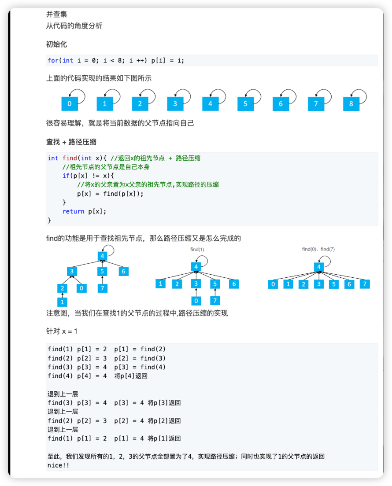

> python3并查集模版
```python3
N = 100010
p = [0] * N
size = [0] * N

#find函数，用于返回x的祖宗节点
#同时压缩往回搜寻节点的路径
def find(x):
    if p[x] != x:
        p[x] = find(p[x])
    return p[x]

for i in range(1, n + 1):
    p[i] = i
    size[i] = 1

# 将a集合合并到b集合
size[find(b)] += size[find(a)]
# a的祖先的父节点=b的祖先
p[find(a)] = find(b)
```