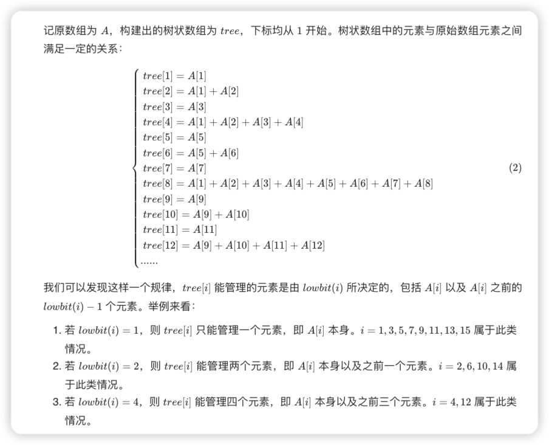
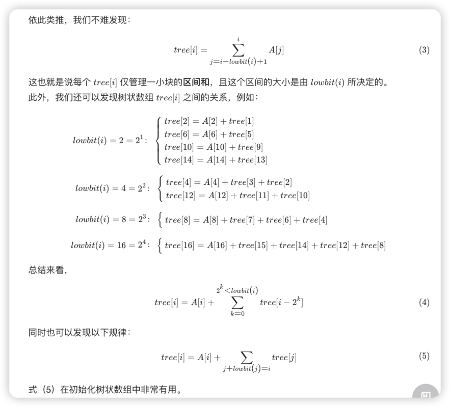
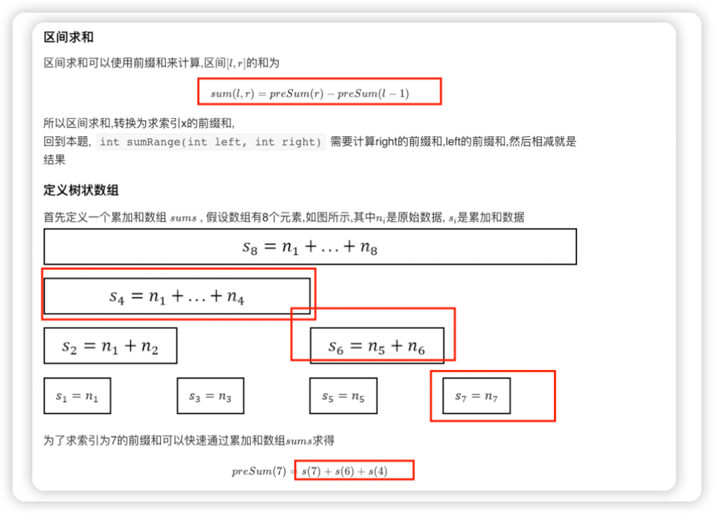

## 树状数组
- 树状数组实质上并不是一棵树，而是根据数组下标（下标从 11 开始）的二进制表示来对数组中的元素进行逻辑上的分层存储，方便数值更新和前缀和查询。






> 树状数组涉及的操作有两个，复杂度均为 O(\log{n})O(logn)：
```java
void add(int x, int u)：含义为在 x 的位置增加 u（注意位置下标从 1 开始）；
int query(int x)：含义为查询从 [1, x] 区间的和为多少（配合容斥原理，可实现任意区间查询）。
```


